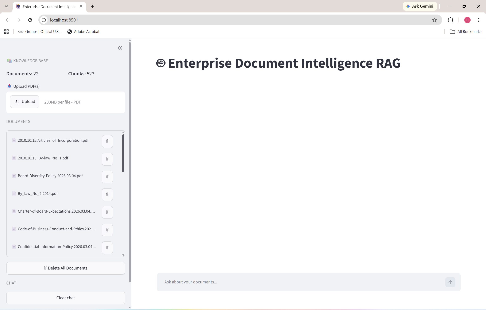
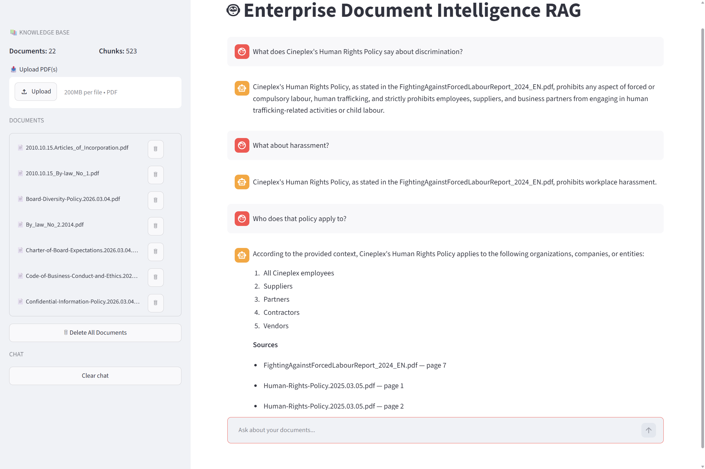
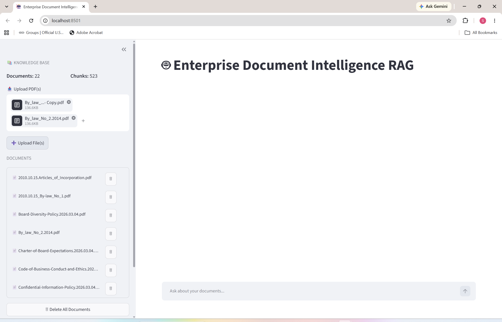
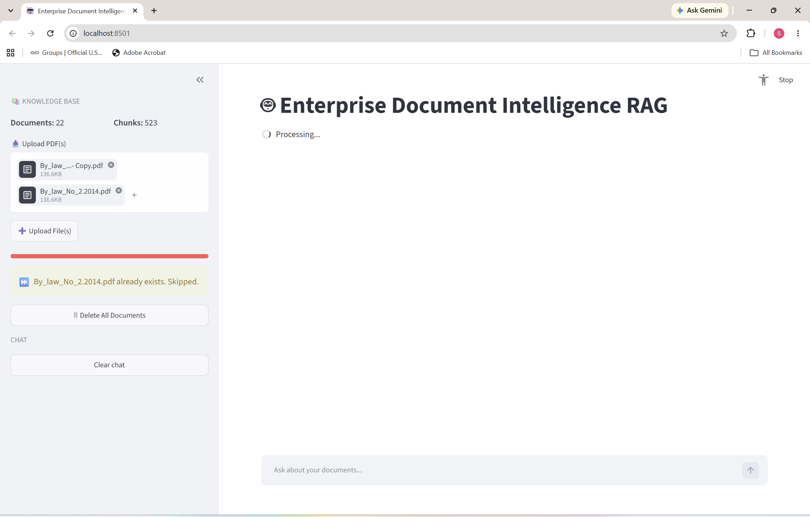
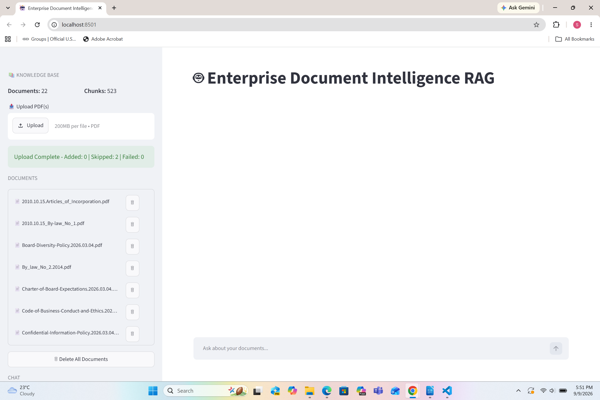
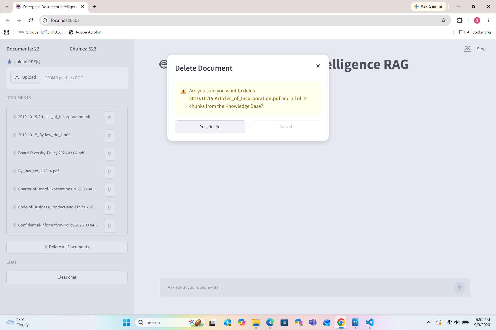

# 🤖 Enterprise Document Intelligence RAG

A fully local **Retrieval-Augmented Generation (RAG)** application for
querying PDF document collections with grounded answers and page-level
source references.

The project combines **hybrid retrieval (semantic search + BM25)**,
**CrossEncoder reranking**, **OCR fallback**, **conversational query
rewriting**, **SHA-256 duplicate detection**, and a **local Llama 3.2
model through Ollama**. The user interface is built with Streamlit,
while ChromaDB provides persistent local vector storage.

> Designed as a portfolio project demonstrating an end-to-end local RAG
> pipeline without requiring a cloud subscription or hosted LLM API.

------------------------------------------------------------------------

## 📸 Application Screenshots

### RAG Main Interface


### RAG Question Answering


### Knowledge Base




### Delete Confirmation


------------------------------------------------------------------------

## ✨ Key Features

-   **Multi-PDF knowledge base** --- Upload and incrementally index one
    or more PDF documents.
-   **Content-based duplicate detection** --- Uses SHA-256 hashes to
    detect the same PDF even when it is uploaded under a different
    filename.
-   **Native PDF extraction + OCR fallback** --- Uses PyMuPDF for normal
    text extraction and Tesseract OCR when a page contains little
    extractable text.
-   **Text chunking** --- Splits extracted document content into
    retrieval-friendly chunks with metadata.
-   **Local embeddings** --- Uses
    `sentence-transformers/all-MiniLM-L6-v2`.
-   **Persistent vector storage** --- Stores embeddings and document
    metadata locally in ChromaDB.
-   **Hybrid retrieval** --- Combines dense vector retrieval with BM25
    lexical retrieval.
-   **Reciprocal Rank Fusion (RRF)** --- Merges dense and BM25 retrieval
    results.
-   **CrossEncoder reranking** --- Reranks retrieved candidates using
    `cross-encoder/ms-marco-MiniLM-L-6-v2`.
-   **Context filtering** --- Limits the final context to the most
    relevant reranked chunks.
-   **Local LLM generation** --- Uses Llama 3.2 through Ollama.
-   **Grounded answers** --- Prompts the model to answer from retrieved
    document context and fall back when the answer is not supported.
-   **Source attribution** --- Displays the PDF filename and
    human-readable page number for supporting sources.
-   **Conversational follow-ups** --- Rewrites context-dependent
    questions into standalone queries when needed.
-   **Document management** --- View indexed documents, delete
    individual PDFs, or clear the knowledge base.
-   **Evaluation pipeline** --- Includes answer, source, retrieval,
    out-of-scope, and LLM-judge evaluation.
-   **Local event logging** --- Records RAG events for monitoring and
    debugging.
-   **Dockerized runtime** --- Packages the Streamlit application and OCR dependencies in a reproducible container.
-   **Docker Compose deployment** --- Runs the published application image with persistent document and ChromaDB mounts and host Ollama connectivity.
-   **CI/CD automation** --- GitHub Actions runs syntax checks, Ruff linting, pytest/coverage, Docker and Compose validation, and publishes multi-platform images to GHCR after merges to `main`.

------------------------------------------------------------------------

## 🏗️ Architecture

                         ┌─────────────────────────┐
                         │      Streamlit UI       │
                         └────────────┬────────────┘
                                      │
                    ┌─────────────────┴─────────────────┐
                    │                                   │
                    ▼                                   ▼
             PDF Ingestion                         User Question
                    │                                   │
                    ▼                                   ▼
          SHA-256 Duplicate Check               Query Rewrite Check
                    │                                   │
                    ▼                                   ▼
       PyMuPDF Text Extraction                  Standalone Query
                    │                                   │
          Low text? ┴─ Yes                              ▼
                    │                         ┌─────────────────────┐
                    ▼                         │  Hybrid Retrieval   │
             Tesseract OCR                    │ Dense + BM25 + RRF  │
                    │                         └──────────┬──────────┘
                    ▼                                    │
              Text Chunking                              ▼
                    │                          CrossEncoder Reranker
                    ▼                                    │
        Hugging Face Embeddings                          ▼
                    │                           Relevant Context
                    ▼                                    │
                ChromaDB                                 ▼
                                                 Llama 3.2 / Ollama
                                                          │
                                                          ▼
                                               Grounded Answer
                                                          │
                                                          ▼
                                                Sources + Page Nos.
```

------------------------------------------------------------------------

## 🧰 Technology Stack

  -----------------------------------------------------------------------
  Technology                          Purpose
  ----------------------------------- -----------------------------------
  Python                              Core application

  Streamlit                           Interactive web interface

  LangChain                           RAG components and orchestration

  ChromaDB                            Persistent local vector database

  Hugging Face / Sentence             Embedding and reranking models
  Transformers                        

  `all-MiniLM-L6-v2`                  Dense embedding model

  BM25 (`rank-bm25`)                  Lexical retrieval

  CrossEncoder                        Retrieval reranking

  Ollama                              Local LLM runtime

  Llama 3.2                           Answer generation

  PyMuPDF                             Native PDF text extraction

  Tesseract + pytesseract             OCR fallback for scanned/low-text pages

  Pillow                              Image handling for OCR
  -----------------------------------------------------------------------

------------------------------------------------------------------------

## 🔄 Document Ingestion Pipeline

When a PDF is uploaded, the application processes it as follows:

Uploaded PDF
     │
     ▼
Read File Bytes
     │
     ▼
Calculate SHA-256 Hash
     │
     ▼
Does Hash Already Exist?
     │
   ┌─┴─┐
  Yes  No
   │    │
   ▼    ▼
 Skip  Save PDF
         │
         ▼
  Extract Page Text
         │
         ▼
  OCR Low-Text Pages
         │
         ▼
      Chunk Text
         │
         ▼
  Generate Embeddings
         │
         ▼
   Store in ChromaDB

### Duplicate Document Detection

Duplicate detection is based on the **actual PDF bytes**, not only the filename.

For example, if these two files contain identical bytes:

employee-policy.pdf
employee-policy-copy.pdf

they generate the same SHA-256 hash. The second upload is therefore skipped before it is permanently added to the knowledge base.

This prevents redundant chunks, embeddings, vector-store entries, and unnecessary OCR/embedding work.

------------------------------------------------------------------------

## 🔎 Retrieval Pipeline

The question-answering pipeline uses multiple retrieval stages:

1.  Determine whether a conversational question needs rewriting.
2.  Convert context-dependent follow-ups into a standalone query when
    necessary.
3.  Retrieve candidates using dense semantic search.
4.  Retrieve candidates using BM25 lexical search.
5.  Combine rankings using Reciprocal Rank Fusion.
6.  Rerank candidates with a CrossEncoder.
7.  Filter candidates using rerank score thresholds and score gaps.
8.  Pass only the strongest chunks to the LLM.
9.  Generate an answer grounded in the supplied context.
10. Display deduplicated document/page sources.

The current configuration limits the final generation context and source
list to reduce irrelevant context and improve answer grounding.

------------------------------------------------------------------------

## 🧠 Conversational Query Rewriting

The application supports follow-up questions such as:

User: What does the Human Rights Policy say about discrimination?
User: What about harassment?

When required, the second question is rewritten into a standalone query
before retrieval so the retriever receives enough context to find the
correct document sections.

Conversation history is used for query understanding rather than being
blindly inserted into every retrieval query.

------------------------------------------------------------------------

## 📄 OCR Fallback

Each PDF page is first processed using normal PyMuPDF text extraction.

If very little text is extracted, the page is rendered as an image and
processed with **Tesseract OCR**. The extraction method is retained in
document metadata.

This allows the knowledge base to handle both:

-   text-based PDFs
-   scanned or image-heavy PDF pages

------------------------------------------------------------------------

## 🛡️ Hallucination Control

When the retrieval pipeline cannot find sufficiently relevant
information, the application returns:

> I couldn't find the answer in the provided documents.

------------------------------------------------------------------------

## 📊 Evaluation

The project includes `evaluate.py` and an evaluation dataset under
`evaluation_data/`.

The evaluation pipeline measures multiple aspects of RAG quality,
including:

-   required-fact coverage
-   semantic answer similarity
-   LLM-based answer judging
-   source recall
-   source precision
-   retrieval recall
-   out-of-scope behavior
-   response timing

Evaluation questions are defined in:

-   evaluation_data/questions.json

Run evaluation with:

-   python evaluate.py

Generated evaluation results are written locally and are excluded from
Git.

------------------------------------------------------------------------

## 📁 Project Structure

enterprise-document-intelligence-rag/
│
├── app.py
├── config.py
├── ingest.py
├── evaluate.py
├── requirements.txt
├── requirements-dev.txt
├── pyproject.toml
├── Dockerfile
├── compose.yaml
├── README.md
├── .gitignore
├── .dockerignore
├── .github/
│   └── workflows/
│       └── ci.yml
│
├── app/
│   └── __init__.py
│
├── conversation/
│   ├── __init__.py
│   ├── memory.py
│   └── query_rewriter.py
│
├── generation/
│   ├── __init__.py
│   ├── llm.py
│   └── prompts.py
│
├── ingestion/
│   ├── __init__.py
│   ├── loaders.py
│   └── splitter.py
│
├── monitoring/
│   ├── __init__.py
│   └── logging_utils.py
│
├── rag/
│   ├── __init__.py
│   └── engine.py
│
├── retrieval/
│   ├── __init__.py
│   ├── embeddings.py
│   ├── hybrid.py
│   ├── reranker.py
│   └── vector_store.py
│
├── data/
│   └── documents/
│       └── .gitkeep
│
├── evaluation_data/
│   └── questions.json
│
├── chroma_db/             # Generated locally; ignored by Git
└── logs/                  # Generated locally; ignored by Git


------------------------------------------------------------------------

## ⚙️ Prerequisites

Choose one of the following ways to run the project.

### Docker Compose (recommended for running the application)

Install:

- **Git**
- **Docker Desktop**
- **Ollama**

The application container includes the Python runtime and Tesseract OCR. Ollama runs on the host machine and is accessed from the container.

### Local Python development

Install:

- **Python 3.11 or 3.12** recommended
- **Ollama**
- **Tesseract OCR**

The first run may download the configured Hugging Face embedding and reranking models.

------------------------------------------------------------------------

## 🚀 Quick Start with Docker Compose

### 1. Clone the repository

```bash
git clone https://github.com/soniakataria10/enterprise-document-intelligence-rag
cd enterprise-document-intelligence-rag
```

### 2. Configure Ollama

Pull the model used by the project:

```bash
ollama pull llama3.2
```

Verify that Ollama is running and the model is available:

```bash
ollama list
```

### 3. Pull the published container image

```bash
docker compose pull
```

### 4. Start the application

```bash
docker compose up -d
```

Open `http://localhost:8501`, upload one or more PDFs from the Knowledge Base sidebar, and begin asking questions.

### 5. View logs or stop the application

```bash
docker compose logs -f
```

```bash
docker compose down
```

The Compose configuration mounts `./data/documents` and `./chroma_db` into the container so uploaded documents and the vector store persist when the container is recreated.

------------------------------------------------------------------------

## 🐍 Local Python Development Setup

Use this option when modifying or debugging the Python application directly.

### 1. Clone the repository

```bash
git clone https://github.com/soniakataria10/enterprise-document-intelligence-rag
cd enterprise-document-intelligence-rag
```

### 2. Create a virtual environment

```bash
python -m venv .venv
```

### 3. Activate the virtual environment

Windows PowerShell:

```powershell
.\.venv\Scripts\Activate.ps1
```

### 4. Install Python dependencies

```bash
python -m pip install --upgrade pip
pip install -r requirements.txt
```

------------------------------------------------------------------------

## 🦙 Configure Ollama

Install Ollama and pull the model configured by the project:

ollama pull llama3.2

Verify that the model is available:

ollama list

Make sure Ollama is running before starting the application.

------------------------------------------------------------------------

## 🔤 Configure Tesseract OCR

Install Tesseract OCR and make the `tesseract` executable available on
your system `PATH`.

Alternatively, set the `TESSERACT_CMD` environment variable to the
executable path.

Example in PowerShell:

$env:TESSERACT_CMD="C:\Program Files\Tesseract-OCR\tesseract.exe"

The application checks `TESSERACT_CMD` first and otherwise attempts to
locate Tesseract from the system `PATH`.

------------------------------------------------------------------------

## ▶️ Run the Application

From the project root with the virtual environment activated:

streamlit run app.py

Then open the local Streamlit address shown in the terminal.

Upload one or more PDFs from the Knowledge Base sidebar and start asking
questions.

------------------------------------------------------------------------

## 🧪 Testing and Code Quality

Development dependencies are defined in `requirements-dev.txt`. After activating the virtual environment, install them with:

```bash
pip install -r requirements-dev.txt
```

Run the same core checks used by CI:

```bash
python -m compileall .
ruff check .
python -m pytest --cov=. --cov-report=term-missing
```

The automated tests focus on deterministic application/evaluation behavior so pull-request CI remains fast and does not require a running Ollama model or a populated production knowledge base. Full RAG evaluation can be run separately with `python evaluate.py`.

------------------------------------------------------------------------

## 🔄 CI/CD Pipeline

The repository uses GitHub Actions for continuous integration and container delivery.

### Pull requests to `main`

The workflow validates changes with:

- Python syntax compilation
- Ruff linting
- pytest unit tests and code coverage
- Docker image build validation
- Docker Compose configuration validation

### After merge to `main`

After the CI jobs succeed, the workflow builds and publishes multi-platform container images for `linux/amd64` and `linux/arm64` to GitHub Container Registry (GHCR). Images are tagged with both `latest` and the Git commit SHA for traceability.

Published image:

```text
ghcr.io/soniakataria10/enterprise-rag:latest
```

The published image can then be pulled and run with Docker Compose without rebuilding the Python application locally. The project currently automates validation, container build, and image publishing; deployment to a hosted production environment is not automated.

------------------------------------------------------------------------

## 💾 Persistent Local Data

Docker Compose uses host bind mounts for runtime data:

```text
./data/documents  -> /app/data/documents
./chroma_db       -> /app/chroma_db
```

This keeps uploaded PDFs and ChromaDB data outside the container lifecycle. Running `docker compose down` removes the container but does not remove these host directories.

------------------------------------------------------------------------

## 💬 Example Questions

After uploading company policy documents, example questions include:-

### Direct retrieval

Q - What does the Human Rights Policy say about discrimination?
Q - What responsibilities do employees have regarding workplace health and safety?
Q - What does the Supplier Code of Conduct require from suppliers?

### Multi-document reasoning

Q - How do the Human Rights Policy and Diversity and Inclusion Policy relate to each other?
Q - How do the Code of Business Conduct and Confidential Information Policy address employee responsibilities?
Q - Which policies could apply to a situation involving both harassment and discrimination?

### Scenario-based

Q - An employee receives confidential company information and wants to share it outside the company. What policies should they consider?

Q - An employee has a personal relationship with a supplier involved in a business decision. What should they do according to the relevant policies?

### Conversational follow-up

Q - What does the Human Rights Policy say about discrimination?
Q - What about harassment?
Q - Who does that policy apply to?
Q - Which other policy is related to this?
Q - How are the two policies different?

### Out-of-scope

Q - What is the population of Canada?

Expected behavior: the system should indicate that the answer could not
be found in the provided documents instead of answering from general
model knowledge.

------------------------------------------------------------------------

## 🗑️ Knowledge Base Management

The Streamlit sidebar supports:

-   uploading multiple PDFs
-   viewing indexed documents
-   viewing document/chunk counts
-   deleting an individual document and its ChromaDB chunks
-   deleting all indexed PDF documents and chunks

------------------------------------------------------------------------

## 🔐 Privacy

The RAG pipeline is designed to run locally:

-   PDFs are stored locally.
-   Embeddings are stored locally in ChromaDB.
-   Llama 3.2 inference runs through the local Ollama runtime.
-   No cloud LLM API is required by the application.

Review the behavior of any third-party model/package downloads
separately when configuring an offline environment.

------------------------------------------------------------------------

## ⚠️ Current Limitations

-   Supports PDF ingestion only.
-   OCR is currently configured for English (`eng`).
-   The application is designed primarily for local/single-user use.
-   Local inference speed depends on the machine running Ollama and the
    selected model.
-   The application does not currently provide
    multi-user authentication, or cloud-scale deployment.
-   Docker deployment still requires an Ollama service running on the host machine; the current Compose configuration is intended for local use.
